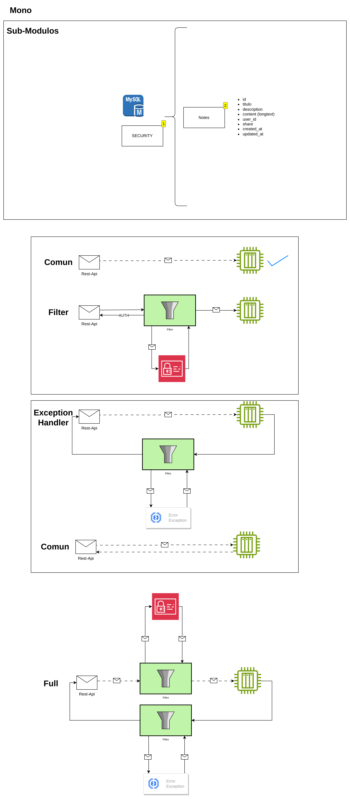

# Notes Practices

# Stack
<li>Java 21</li>
<li> Spring Boot v3.2+</li>
<li> Swagger </li>
<li> Redoc </li>
<li> JWT</li>
<li> bCrypt</li>
<li> Mysql</li>
<li> Redis</li>
<li> Docker</li>
<li> Docker Compose</li>


## Run
``` shell
mvn clean install
sh notes.sh
```

### Filter Example
